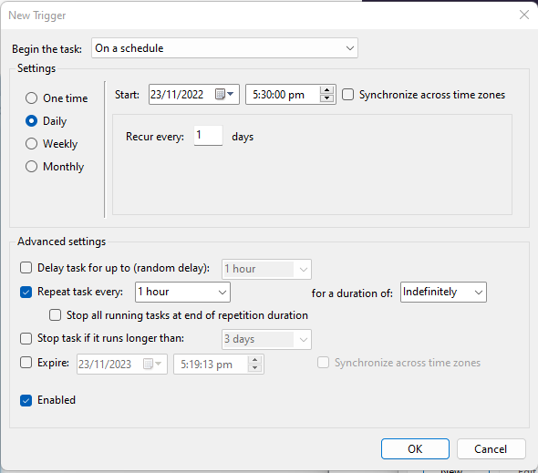
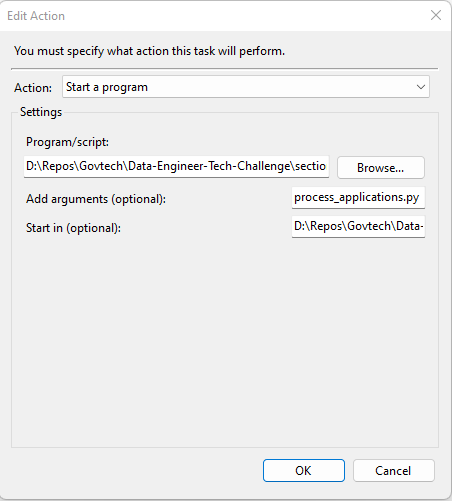

# Section 1: Data Pipelines

Dependencies:
- pyspark v3.3.1
- pandas v1.5.1
- hadoop

Install Pyspark and Hadoop by following the instructions [here](https://medium.com/@farhan0syakir/setup-pycharm-hadoop-pyspark-development-on-windows-without-installing-hadoop-6aa7bde7d189). 
The tutorial assumes Windows OS and Pycharm IDE.

Execute the data pipeline on the latest data (according to directory name in format `%Y%m%d%H`) in `applications`.
```
python3 process_applications.py
```

Outputs are written to `failure` and `success` directories.

As Windows OS was used for this assignment, Windows Task Scheduler is the most convenient tool for scheduling. For Linux/Mac OS, crontab can be used. For more complex workflows, Airflow is recommended.

To schedule the task on Windows, follow instructions in this [tutorial](https://www.jcchouinard.com/python-automation-using-task-scheduler).

Example configuration:



