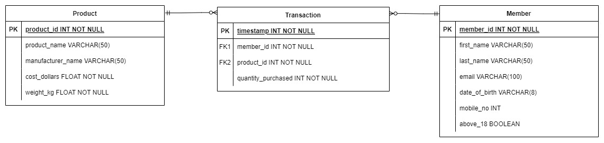

# Section 2: Databases

### ER Diagram

- Each Product can belong to zero or more Transactions
- Each Transaction has exactly 1 product
- Each Member can belong to zero or more Transactions
- Each Transaction involves exactly 1 Member


Build the Docker image from Dockerfile:
```
docker build -t sales-db .
```

Run a sales_db container. This starts the database and creates the tables in `sql/create_table.sql`.
```
docker run --name sales_db -p 5432:5432 sales-db:latest
```

Stop containers and remove image:
```
docker container ls
docker stop -t 60 <container_id>
docker rm <container_id>

docker images
docker image rm <image_id>
```
