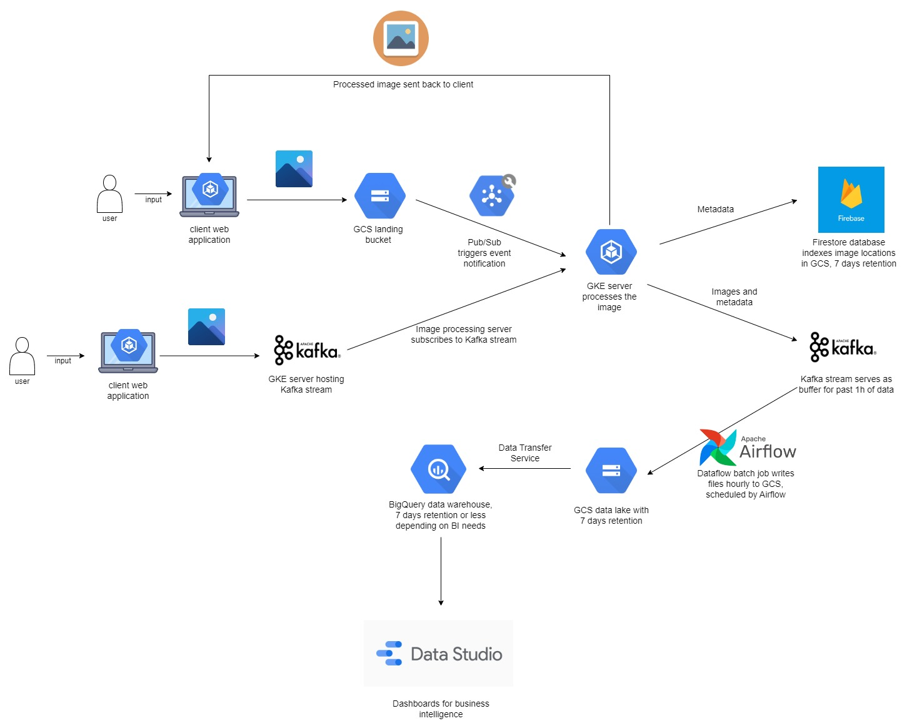

# Section 3: System Design

### Requirements
- Must use the cloud
- Majority of data is images
- Also need to store image metadata and customer info

### System Components and Proposed Solutions
Component 1: External facing web application (frontend)
- Users can upload images to the cloud through an API

Component 2: Internal web application (frontend)
- A Kafka stream uploads images to the cloud
- The stream is managed by company's engineers

Component 3: Image processing (backend)
- Runs on the cloud
- Image processing software processes the images uploaded
- Images and metadata have a retention period of 7 days

#### Proposed architecture:
1. Web client uploads image to Google Cloud Storage (GCS) bucket via an API. Pub/Sub triggers an event notification when 
a new file is uploaded, which is received by a Google Kubernetes Engine (GKE) image processing service.
2. Alternatively, the web client uploads images to a Kafka stream. The image is received by the subscribed GKE servers.
3. Backend image processing runs on GKE instances. Docker is used for containerization of apps. GKE is important for 
scalability as it performs container orchestration and automatically spins up new instances if one crashes.
4. Images and metadata are stored in both GCS and Cloud Firestore. Firestore, a NoSQL DB, indexes the files for fast 
retrieval if OLTP requests need to access this data. As it is not recommended to store images in a database, they can 
be stored on GCS, which serves as the data lake.

Component 4: Data processing
- Runs on the cloud
- Batch data processing to transform and clean other data for in-house analytics
- Data has a retention period of 7 days

Component 5: Business intelligence resource
- For data analysts to query the stored data

#### Proposed architecture:
1. Data is buffered in a Kafka stream and written in batch every hour to GCS.
2. Apache Airflow can be used to schedule data processing/transfer jobs on a daily or hourly basis. Dataflow can be 
used to run these jobs as it integrates well with GCS and BigQuery.
3. BigQuery will serve as the data warehouse, enabling data exploration using SQL.
4. DataStudio can be used to build high-level visualizations using data in BigQuery.
    

### Pros and cons of design:
- All steps integrate well with the GCP ecosystem.
- GKE requires more maintenance than fully managed serverless solutions like Cloud Run. However, GKE is more flexible 
and costs less. If the image processing logic is simple, Cloud Run and Cloud Functions are good alternatives as they 
are much easier to maintain.

### Assumptions:
- Company's engineers have experience setting up and maintaining GKE instances.
- Web apps can be containerized and deployed on Kubernetes instances.
- Firestore facilitates OLTP requests like fetching and displaying all the images uploaded by a user within the past month. 
If such requests don't occur, it's sufficient to just use BigQuery for OLAP.
