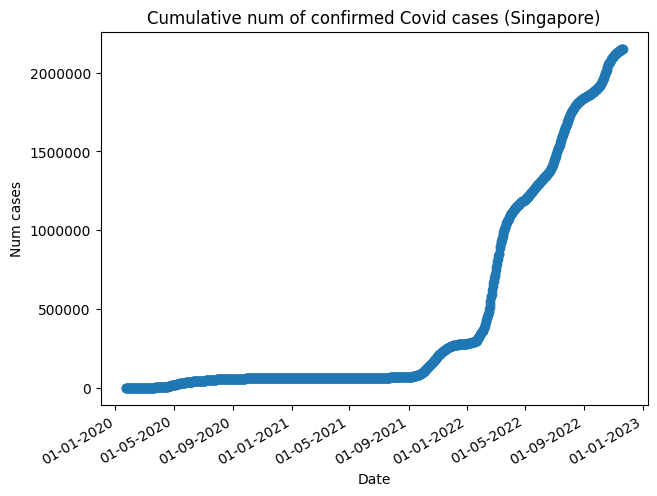

# Section 4: Charts & APIs



Install dependencies: pandas, matplotlib, requests

Request and save data on number of confirmed Covid cases into csv:
```
python3 get_covid_data.py
```

Plot the graph:
```
python3 plot_cases.py
```
