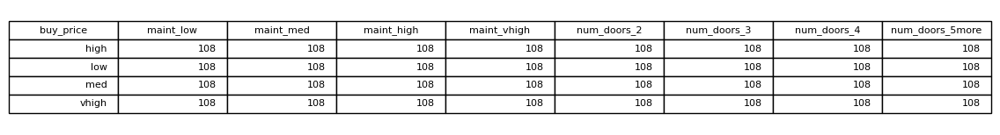
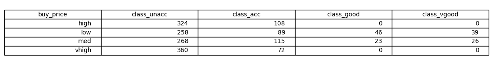

# Section 5: Machine Learning

Dependencies:
- scikit-learn
- pandas

Train:
```
python3 train.py
```

Train and predict buying price for input features ['high', '4', 'big', 'high', 'good']:
```
python3 predict.py
```

Output obtained from Decision Tree Classifier:
```
Train accuracy:
Accuracy 0.3217535153019024, Precision 0.4708165322038361, Recall 0.3217535153019024
Test accuracy:
Accuracy 0.3159922928709056, Precision 0.4581909892549521, Recall 0.3159922928709056

The predicted buying price is low.
```

Observations:
- A few different models (KNN, SVM, Decision Tree) all yielded very low test accuracies of between 20-30%.
- The reason for this is investigated in `explore_data.py`. In Table 1 below, we see that there is no 
correlation between the buy_price and features like maintenance and number of doors.
- This dataset was artificially generated to predict the class value. Hence, the only feature that can 
help us predict the buy price is the class value.

Table 1: Number of occurrences of each category of maint and num_doors features per buy_price:



Table 2: Number of occurrences of each category of class_value per buy_price:

